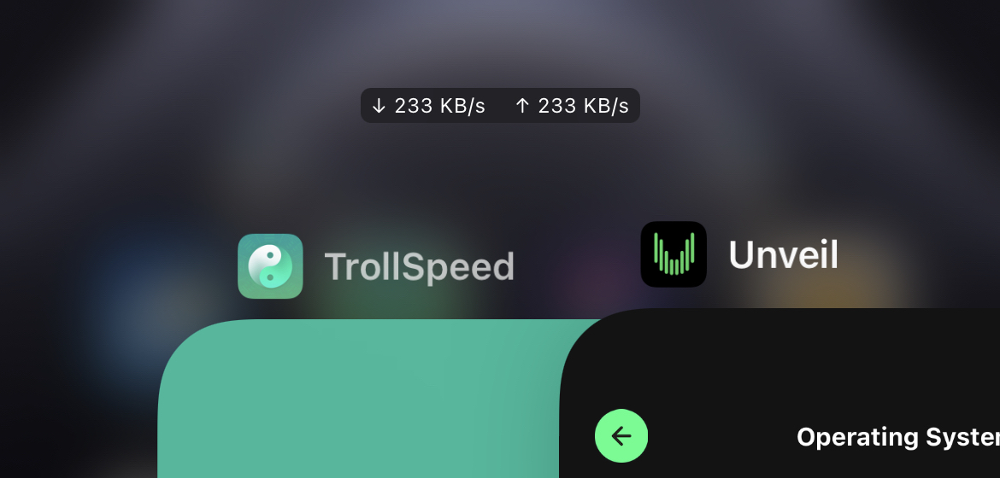

# TrollSpeed

[now-on-havoc]: https://havoc.app/package/trollspeed 

[][now-on-havoc]

Shows upload &amp; download speed below the status bar.

Tested and expected to work on all iOS versions supported by opa334’s TrollStore.

## How it works?

[TrollStore](https://github.com/opa334/TrollStore) + [UIDaemon](https://github.com/limneos/UIDaemon) + [NetworkSpeed13](https://github.com/lwlsw/NetworkSpeed13) + (some magic)
\=

- An TrollStore app to spawn HUD process with root privilege.
- Don’t call `waitpid` to that process. Let it go.
- A HUD app with entitlements from `assistivetouchd` to display and persist global windows.

## How to build?

- Use [theos](https://github.com/theos/theos) to compile.
  - `FINALPACKAGE=1 make package`
- You'll get a `.tipa` file in `./packages` folder.
- Don't like **theos**? Use `./build.sh` to build with Xcode.

## Caveats

- Spawn with root privileges is **required**. Otherwise, the HUD process will be killed by SpringBoard when unlocking device.
- TrollSpeed will observe its app removal and terminate its HUD.

## Notes

- Please give me feedback if you find any issues &amp; bugs, or have any suggestions.
- Give me a star 🌟 if you like this project. Thanks!

## Screenshots

## Special Thanks

- [KIF](https://github.com/kif-framework/KIF)
- [SPLarkController](https://github.com/ivanvorobei/SPLarkController) by [@ivanvorobei_](https://twitter.com/ivanvorobei_)
- [TrollStore](https://github.com/opa334/TrollStore) by [@opa334dev](https://twitter.com/opa334dev)
- [UIDaemon](https://github.com/limneos/UIDaemon) by [@limneos](https://twitter.com/limneos)
- [NetworkSpeed13](https://github.com/lwlsw/NetworkSpeed13) by [@johnzarodev](https://twitter.com/johnzarodev)
- [SnapshotSafeView](https://github.com/Stampoo/SnapshotSafeView) by [Ilya knyazkov](https://github.com/Stampoo)

## License

TrollSpeed is [Free Software](https://www.gnu.org/philosophy/free-sw.html) licensed under the [GNU Affero General Public License](LICENSE).

### Localization

To add a language, create a new `.lproj` folder in `Resources`.

- en/zh-Hans [@Lessica](https://github.com/Lessica)
- es [@Deci8BelioS](https://github.com/Deci8BelioS)
